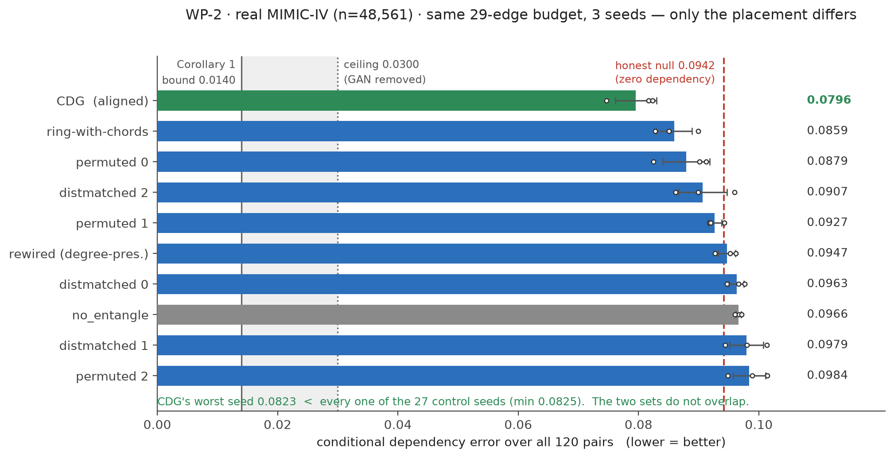
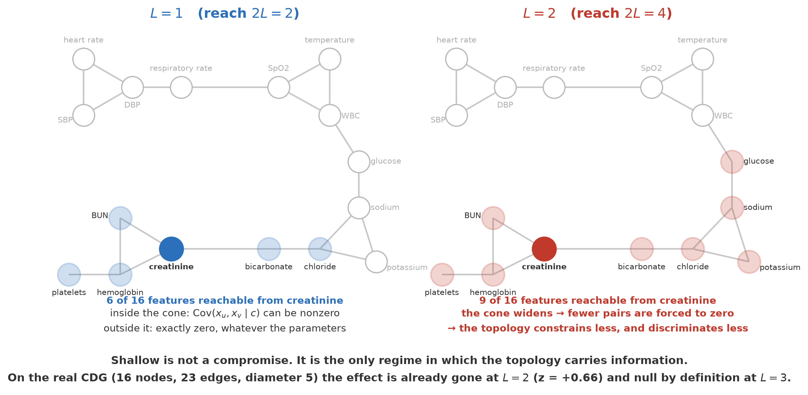
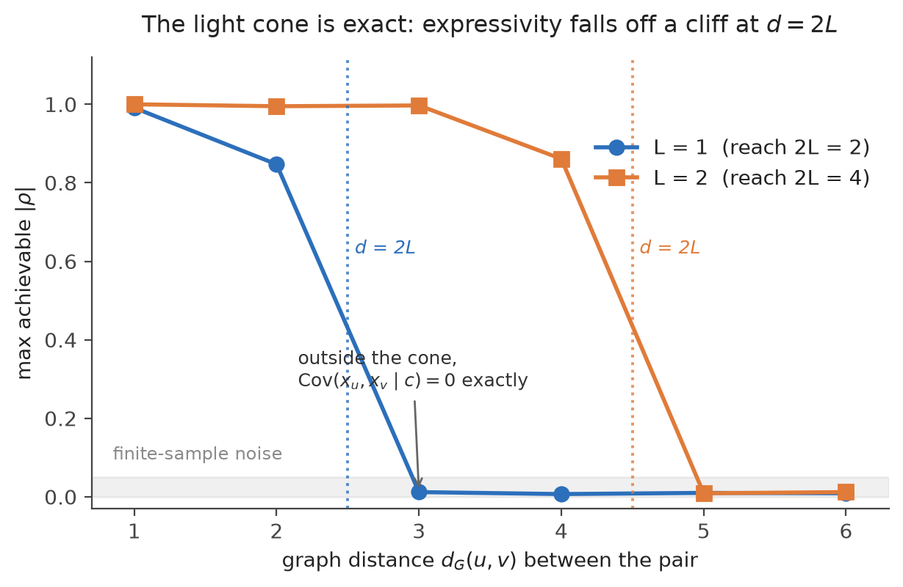
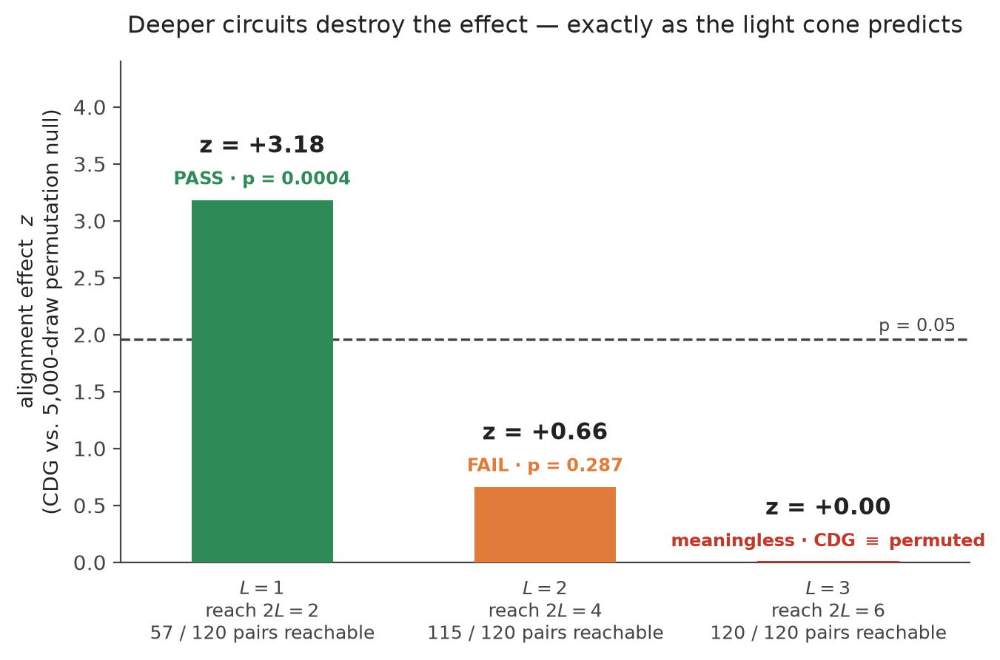
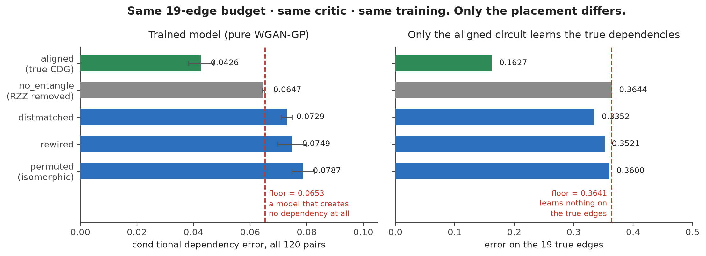
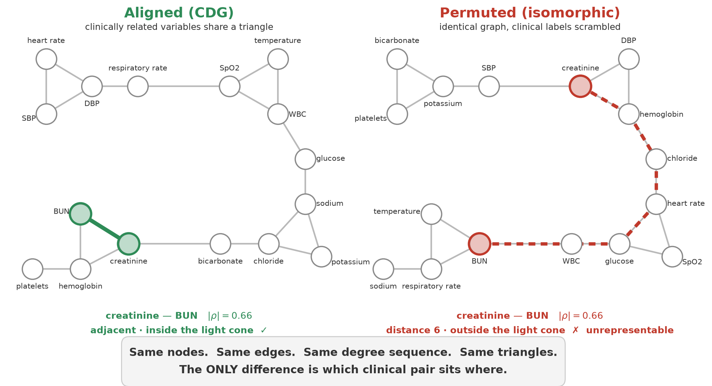
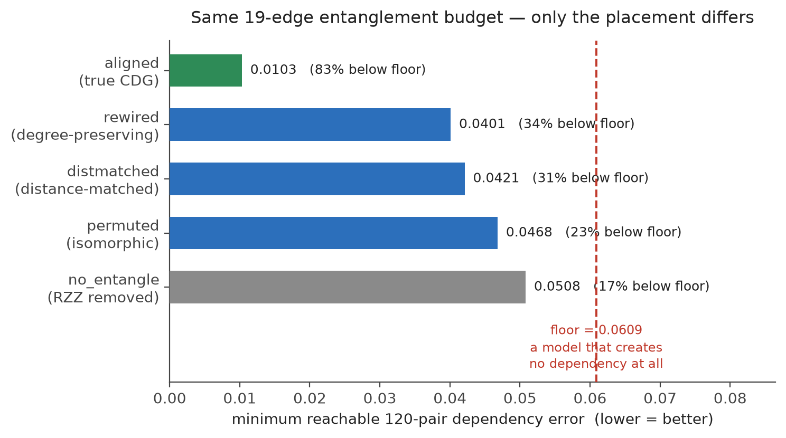

# CDG-QGAN

A hybrid quantum-classical GAN that takes the Clinical Dependency Graph as the
**entanglement topology** of a shallow parameterized quantum circuit, to generate synthetic
MIMIC-IV ICU data.

The core claim: if the conditional dependency graph among clinical variables (the CDG) is
planted directly into the circuit's RZZ layout, it recovers the dependency structure better
than an **isomorphic permutation** of that same graph using identical resources. In other
words, "Clinical" is not a mere modifier — it demonstrably contributes bits.

## Where this stands

**This is a structural result, not a performance result.** Both halves are stated here because a
paper that reports only the first is selling something.

**The topology hypothesis holds.** On real MIMIC-IV v3.1 (n = 48,561), against nine matched control
topologies at three seeds each — `RESULTS_wp2.md`:



*Open circles are individual seeds. The reference line is the* honest null *(0.0942) — a model with
exactly zero conditional cross-feature dependence but correct conditional marginals — and not the
permutation floor (0.0985), which hands any such model ~4 % for free through the evaluator's
conditioning basis (§E-12).*

```
CDG − permuted          (isomorphic)      = −0.0134   95% CI [−0.0187, −0.0086]
CDG − distance-matched                    = −0.0154   95% CI [−0.0202, −0.0109]   <- decisive
CDG − rewired           (degree-preserving) = −0.0151 95% CI [−0.0197, −0.0114]
CDG − ring-with-chords                    = −0.0064   95% CI [−0.0120, −0.0014]
CDG − no_entangle                         = −0.0171   95% CI [−0.0218, −0.0142]
```

Every CI excludes zero, with **29 entangling angles**. And without any bootstrap: the CDG's *worst*
seed (0.0823) beats *every one* of the 27 control seeds (minimum 0.0825) — the two sets do not
overlap. The **distance-matched** control is the one that matters: it fixes the distribution of graph
distances over all 120 pairs and varies only **which** pairs sit where. What survives is not "the
circuit reaches more pairs" but "it reaches the *right* pairs."

**The performance hypothesis does not.** On the same split, against classical baselines —
`RESULTS_wp3.md`:

| | dep. error | TSTR AUROC |
|---|---|---|
| gaussian copula (the **oracle** for this metric) | **0.0064** | **0.8073** |
| CDG-QGAN Δ=4 | 0.0765 | 0.7803 |
| **no_entangle** | 0.0975 | **0.7848** |
| TVAE | 0.0708 | 0.7736 |
| CTGAN | 0.0935 | 0.6999 |

**A circuit with zero entangling gates beats the CDG on TSTR.** The cross-feature dependency
structure — the subject of this paper — is worth **nothing** on in-ICU mortality prediction. We beat
TVAE, but so does `no_entangle`: the win comes from the conditional marginals, not the topology.

The trained model reaches 0.0765 against a ceiling of **0.0300** that the same circuit reaches with
the GAN removed. **The binding constraint is the optimizer, not the light cone** — which is the one
open lever left (WP-6).

## Skeleton of the design

- **1 feature = 1 qubit.** Each feature gets its own local latent variable `z_u`, encoded as
  an angle.
- **RZZ only on CDG edges.** The entangling angle `gamma` is the only parameter that can
  create cross-feature dependency.
- **A per-feature one-dimensional local head** `h_u(q_u, c)`. It cannot see `q_v` from any
  other qubit. The classical parameters therefore **structurally cannot create** conditional
  cross-feature dependency (`model.assert_no_cross_feature_mixing` verifies that the head
  Jacobian is exactly diagonal).
- **Proposition 1 (light cone).** With a product initial state and local angle encoding,
  `<Z_u>` depends only on qubits within graph distance `L` of `u`. Corollary: if
  `d_G(u,v) > 2L` then `Cov(x_u, x_v | c) = 0` — exactly, not approximately. We also exploit
  this identity computationally: instead of a 2^16 statevector we simulate only a
  2^|N_L(u)| subcircuit per qubit.

### Why the decoder has to be this crippled


A dense decoder could manufacture cross-feature dependency out of thin air, and then the
quantum core would prove nothing. Restricting each head to one qubit makes the entangling
angles the **only** parameters in the model that can create dependency — so any dependency
structure we observe in the output came from the circuit topology, and nowhere else.

### The light cone is exact, and it is why the circuit must be shallow

The light cone of a feature is the set of features it can possibly depend on. It widens with
depth, and once it swallows the whole graph the topology stops saying anything.



The cliff at `d = 2L` is not an approximation — it is exact, and it is measurable. Optimizing
the circuit to maximize the correlation of a single pair at graph distance `d`, the achievable
`|ρ|` collapses precisely at `d = 2L`, independently at `L=1` and `L=2`. Outside the cone the
maximum is 0.012, which is sampling noise, not expressivity.



This is what forces `L=1`. On the real CDG, `L=2` already fails the alignment precheck, and at
`L=3` all 120 pairs fall inside the cone — the CDG becomes **identical to a permuted graph by
definition**. The effect decays exactly as the theory predicts:



`L=1` is not a compromise. It is the only operating point at which expressivity and
discriminative power hold simultaneously. See `REVISIONS.md` A-1 for the full argument.

## Results

### A trained model recovers the alignment effect

This is the headline. Every variant gets the **same 19-edge entanglement budget, the same
critic, the same optimizer, the same objective**. The only difference is which clinical pair
sits under which RZZ gate. The model is trained adversarially with **pure WGAN-GP** — no
dependency term, nothing borrowed from the evaluation metric.



| Model | \|E\| | 120 pairs (conditional) | 19 true edges |
|---|---|---|---|
| **aligned (true CDG)** | 19 | **0.0426 ± 0.0043** | **0.1627** |
| no_entangle (RZZ removed) | 0 | 0.0647 ± 0.0003 | 0.3644 |
| *floor — creates zero dependency* | — | *0.0653* | *0.3641* |
| distmatched | 19 | 0.0729 ± 0.0020 | 0.3352 |
| rewired | 19 | 0.0749 ± 0.0051 | 0.3521 |
| permuted (isomorphic) | 19 | 0.0787 ± 0.0040 | 0.3600 |

`aligned − distmatched = −0.0303` against a per-variant SD of ~0.004 — and `distmatched` is the
control that matters, because it matches the CDG's held-out pair distance profile, so "the
strong pairs happen to be nearby" is no longer an advantage the CDG uniquely holds. It still
loses.

Read the right-hand column. **Only the aligned circuit learns the true dependencies at all.**
Every control sits at the floor (0.335–0.364 against 0.3641) — not because it was trained less,
but because Corollary 1 *forbids* it: its strong pairs were scattered beyond `2L`, where the
conditional covariance is exactly zero at every parameter setting.

And two results we did not predict:

- **`no_entangle` lands exactly on the floor** (0.0647 vs 0.0653, SD 0.0003). Strip the RZZ
  gates and the model creates no dependency whatsoever. Everything aligned achieves, it achieves
  through the entangling angles — nothing else in the model can.
- **Misplaced entanglement is worse than none.** `no_entangle` beats permuted, rewired *and*
  distmatched, all of which score worse than the floor. A misaligned circuit still cannot learn
  the dependencies that exist, but it does manufacture ones that do not. The entangling gates are
  not a free prior; they are a **commitment** that these particular pairs are dependent. Assert it
  about the wrong pairs and you are strictly worse off than never having asserted it.

Details, and the three things that had to be fixed before this experiment could mean anything:
`RESULTS_confirm.md`.

### The same conclusion at the representational level

The whole claim rests on one contrast. Take the CDG, and relabel it: keep every node, every
edge, the degree sequence, and the triangles, and change **only which clinical variable sits
on which qubit**. A strongly dependent pair that was adjacent is now far apart — and by the
corollary, *unrepresentable at any parameter setting*.



The triangles are the mechanism. They are why a strong pair stays at distance 2 — inside the
cone — even when its own edge is held out. A permutation scatters those pairs beyond `2L`,
and no amount of training can recover what the topology has forbidden.

With the GAN removed and the circuit optimized directly on the full 120-pair dependency
pattern, that is exactly what happens. Every variant gets the **same 19-edge budget**:



`distmatched` is the control that matters most: it matches the CDG's held-out pair distance
distribution, so the "advantage of being nearby" is cancelled out. The CDG still leads it by
4.1×. **The advantage comes from the edges the CDG chose carrying real dependency structure,
not from graph combinatorics.** Details: `RESULTS_ceiling_joint.md`.

### Confirmed so far

| | Result | Document |
|---|---|---|
| **Trained model, CDG vs. every control** | **aligned 0.0426 vs. distmatched 0.0729 (floor 0.0653)** | **`RESULTS_confirm.md`** |
| The light-cone cliff appears exactly at `d = 2L` | outside it, max \|ρ\| = 0.012 | `RESULTS_ceiling.md` |
| Adjacent-pair expressivity ceiling (`L=1`) | \|ρ\| = 0.991 | `RESULTS_ceiling.md` |
| Alignment precheck `M(G,L)` on the real CDG | `L=1`: z = +3.18 (p = 0.0004) · `L=2`: z = +0.66 (rejected) | `RESULTS_precheck.md` |
| Joint 120-pair ceiling, CDG vs. controls | aligned 0.0103 vs. permuted 0.0468 (floor 0.0609) | `RESULTS_ceiling_joint.md` |
| Light-cone simulator optimization | ~70× speedup (>1800 s → 25.7 s / seed) | `WP6_REPORT.md` |

## The finding that nearly killed this project

For a while, the confirmatory experiment returned nothing at all. Every graph variant scored the
same, and the model with **no entanglement whatsoever** was the best of them. Read naively, that
says the CDG hypothesis is false.

It was not. **The critic was blind to dependency, so nothing was learning any.** And when
nothing learns dependency, every structural hypothesis you might want to test looks equally
false, because every model is equally empty.

The tell was cheap, and we should have looked for it sooner: **compute the score of a model that
creates no dependency at all.** Ours was 2.1× *better* than the model we had trained (0.0648 vs
0.1359). A trained model losing to a do-nothing baseline is not a weak result — it is a broken
pipeline.

What was actually wrong:

1. **The critic spent its capacity on the marginals** — which the ~2000 classical head
   parameters can already fit unaided — and handed the entangling angles nothing but noise.
   Sweeping the quantum learning rate over 1000× did not help; at `lr_q = 5e-2` the angles move
   2.0 radians and *still* learn nothing (`RESULTS_lr.md`). Neither did a bigger batch, nor a
   batch-aware critic on its own, nor a dependency term in the loss. All of those are recorded.

   The fix: **rank-transform each feature within the batch before the critic sees it.** Every
   input is then standard normal by construction, the marginals carry no information, and the
   only thing left to discriminate on is the copula. The gradient has nowhere to go but the
   entangling angles. True-edge error: 0.4029 → 0.2663, and → 0.1892 once minibatch
   discrimination is added on top.

2. **The metric was the wrong estimator.** The CDG is *defined* as a partial correlation
   conditional on `c`, but the metric measured the unconditional one — so everything `c` induced
   was scored as a false positive on every pair. This was live in the real MIMIC pipeline, not
   just the benchmark.

3. **The benchmark's teacher drew `c` independently of `X`**, which is not what MIMIC looks like
   and which hid (2) from view.

The loss is still pure WGAN-GP. No dependency term, nothing borrowed from the evaluation
metric — the fixes are architectural, and the anti-circularity rule survives intact.

**The general lesson outlives this paper.** A tabular GAN whose decoder can fit the marginals
will let the critic settle for the marginals, and then nothing learns the dependency structure —
for any architecture, any topology, any hyperparameter. Always score the do-nothing model first.

## Data

MIMIC-IV / eICU are subject to PhysioNet **credentialed access + a Data Use Agreement**.
Neither the raw data nor any **patient-level** data derived from it may ever enter this
repository. All of it stays in the local archive only. Paths and acquisition instructions are
in `DATA.md`.

### One feature had to be thrown out


Mean arterial pressure is not a clinical dependency — it is an **arithmetic identity**,
`MAP ≈ (SBP + 2·DBP)/3` with R² = 0.860 on n = 51,587. Because it is a deterministic function
of SBP and DBP, conditioning on it in the precision matrix **flips the sign** of ρ(SBP, DBP)
from +0.499 to −0.508: a collider artifact that puts a physiologically incorrect edge into
the CDG. It also hands a reviewer an easy dismissal — *"you recovered division by three."*

MAP is still extracted, but only as an evaluation variable: we compute `MAP~` from the
generated `SBP~` and `DBP~` and compare it against the real distribution, which is a stricter
test than generating it directly. WBC took its slot — this is critical-care data and the
inflammation axis was missing entirely. Hematocrit was dropped from the fallback list for the
same reason (`Hct ≈ 3 × Hb`, r = 0.962).

## Environment

```
conda env create -f environment.yml   # env name: cdg-qgan
```

**numpy is pinned to 2.2.6. Do not upgrade it** — torch 2.11+cu128 is built against the
numpy 2.2 ABI, and upgrading breaks the loading of `shm.dll`. Any additional installation
must go through the constraints file:

```
python -m pip install -c .backup/constraints.txt <pkg>
```

`tools/mimic-code` is cloned separately:

```
git clone https://github.com/MIT-LCP/mimic-code tools/mimic-code
```

## Documents

- `CDG-QGAN_research_plan_v2.md` — the research plan (the reference document)
- `REVISIONS.md` — **where this conflicts with the plan, this takes precedence.** Confirmed
  corrections, and §E, the open problem above
- `HANDOFF.md` — work package specifications (WP-2 through WP-6)
- `DATA.md` — data locations and environment pitfalls
- `RESULTS_ceiling.md` · `RESULTS_ceiling_joint.md` · `RESULTS_precheck.md` — results
- `FIGURES.md` — figure specifications
- `CDG-QGAN_research_plan_v1.md` — superseded, kept for history

Figures under `figures/` are produced by `scripts/make_figures.py` from the measured values.
Nothing in this repository is an artist's impression of a result.
